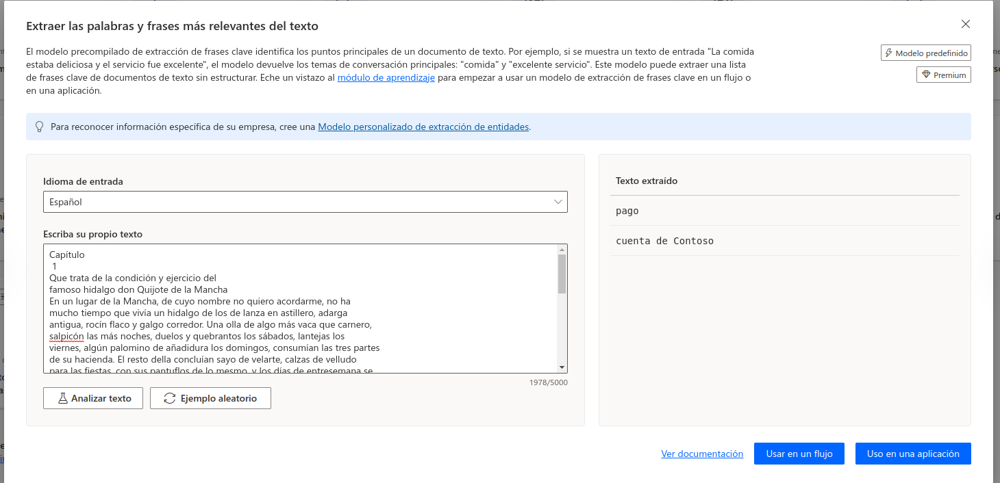

He usado la opción de extrar las palabras y frases más relevantes del texto, para ello he usado el texto del capitúlo 1 del libro "El Quijote":

Le doy a la opción Analizar Texto, y me dice que las siguientes palabras son las más relevantes:
famoso Feliciano de Silva,cincuenta años,complexión recia,rocín flaco,famoso hidalgo,
añadidura,condición,salpicón,narración,afición,administración,Capítulo,don Quijote
galgo corredor,Una olla,sábados,tres partes,días,gran madrugador,caballerías,muchas hanegas
entricadas razones,sobredicho hidalgo,la Mancha,ejercicio,lugar
nombre,lanza,astillero,vaca,carnero,noches,duelos,quebrantos,lantejas,palomino,domingos
hacienda,resto,velarte,calzas,velludo,fiestas,pantuflos,vellorí,casa,ama,cuarenta
sobrina,mozo,campo,plaza,podadera,Frisaba,edad,carnes,enjuto,rostro,amigo,caza,Quieren
Quijada,Quesada,diferencia,autores,caso,conjeturas,cuento,punto,verdad
ratos,libros,gusto,curiosidad,desatino,tierra,sembradura,claridad,prosa,perlas.
