Vamos a usar n8n para automatizar tareas en nuestro día a día.

# ¿Qué es n8n?


# Instalación
Procederemos a instalarlo con docker, recomiendo tener docker instalado en tu equipo si no lo tienes te dejo el siguiente enlance donde recomiendo la opción 3 (https://kinsta.com/es/blog/instalar-docker-ubuntu/), después ejecutamos el siguiente comando:
```
docker run -it --rm \
	--name n8n \
	-p 5678:5678 \
	-e GENERIC_TIMEZONE="Europe/Madrid" \
	-e TZ="Europe/Madrid" \
	-v ~/.n8n:/home/node/.n8n \
	n8nio/n8n \
	n8n start --tunnel
```
Me gustaría recalcar que debemos poner el --tunnel para poder usar el webhook de n8n con las aplicaciones.

# Primeros pasos
Una vez instalado, nos dirigimos a http://localhost:5678 y nos dara la opción de crear un usuario y contraseña.
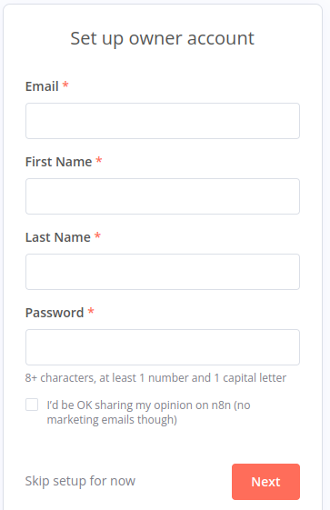
Luego nos preguntara para que lo queremos usar, recomiendo seleccionar I'm not using n8n for work.
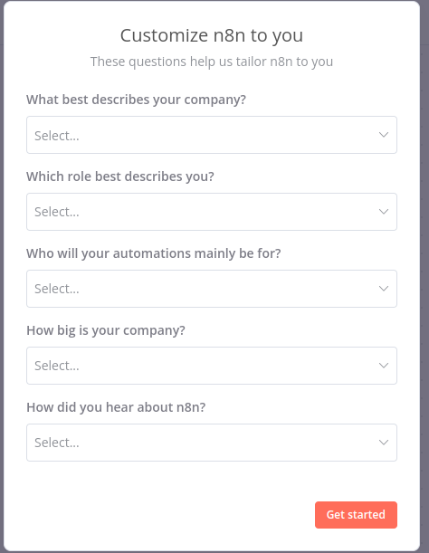
Y ya lo tendríamos instalado y listo para usar.
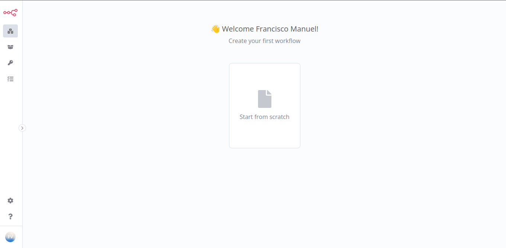

# Creación de un workflow
Tenemos dos formas de crear un workflow, la primera es desde la propia opción de Workflows y la segunda es desde la opción de Templates.

## Creación de un workflow desde Templates
Vamos a crear un workflow desde Templates, para ello vamos a la opción de Templates y seleccionamos el que queramos, en mi caso he usado Get Weather Forecast via Telegram.
Le damos y dentro le damos a Use this workflow.

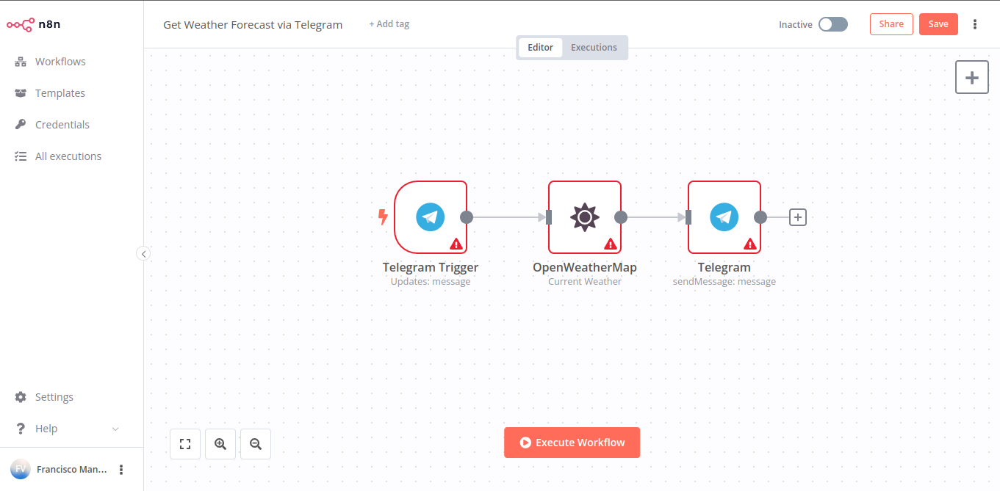
Vemos que tenemos diferentes avisos así que vamos a solucionarlos.
Le damos a Telegram Trigger.
Vemos que el error es por no tiene una credencial para conectarse, en mi caso ya tengo el bot creado así que inserto su api, en caso de no tenerlo, os dejo la documentanción para crear el bot (https://docs.n8n.io/integrations/builtin/credentials/telegram/?utm_source=n8n_app&utm_medium=left_nav_menu&utm_campaign=create_new_credentials_modal)
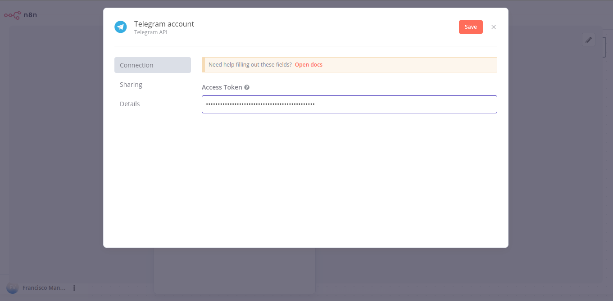
Ahora le damos a OpenWeatherMap y le insertamos la api key, en caso de no tenerla os dejo la documentación para crearla (https://docs.n8n.io/integrations/builtin/credentials/openweathermap/?utm_source=n8n_app&utm_medium=left_nav_menu&utm_campaign=create_new_credentials_modal)
Rellenamos los datos tal que así y recomiendo dejar el idioma en inglés ya que la traducción no es muy buena.
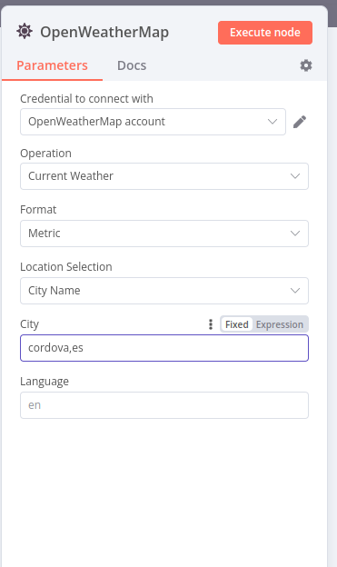
Y ya estaría, ahora le damos a Execute Workflow, y nos dice que esta Waiting for Trigger Event, ahora vamos a Telegram y le damos a start a nuestro bot.
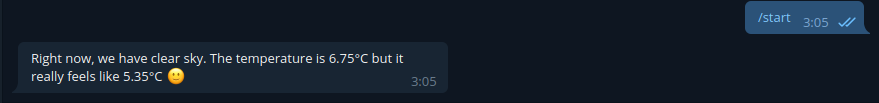
Y ya tenemos un Workflow creado para que nos diga el clima cuando queramos.

## Creación de un workflow desde Workflows
Ahora voy a crear un workflow desde Workflows, para ello vamos a la opción de Workflows y le damos a Add Workflow.
Nos da las siguientes opciones.
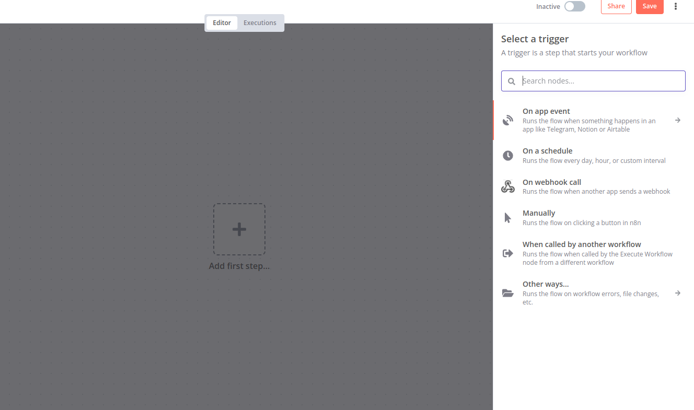
On app event -> Cuando se ejecute una acción en la aplicación.
On a schedule -> Cuando se ejecute una acción en un horario.
On webhook call -> Cuando se ejecute una acción en un webhook.
Manually -> Se ejecuta manualmente.
When called by another workflow -> Cuando se llama a otro workflow.
Other ways -> Otras formas de ejecutarlo.
Recomiendo On app event.

Vamos a crear un workflow que envie mensajes a un canal de telegram para esto necesitamos sacar el chat ID, añadiendo al bot raw_data_bot y mi propio bot, importante dejar el canal en modo público.
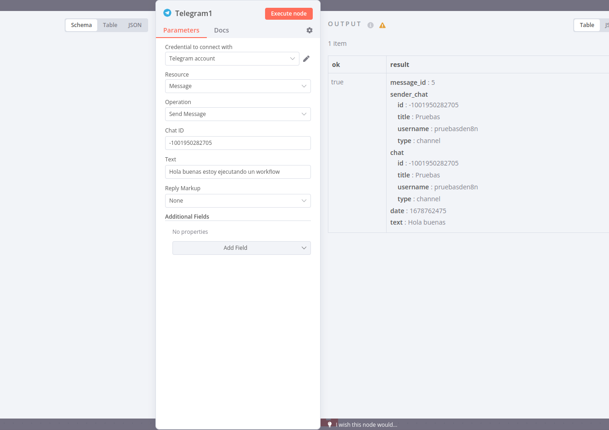

Lo ejecutamos.

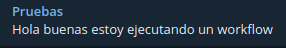

Ahora vamos a darle el siguiente paso que sería iCalendar y creamos un evento
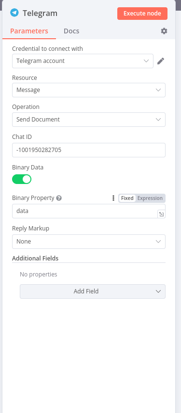

Vemos que lo hemos recibido.


Ya por último ejecutamos el workflow y vemos que nos ha enviado el mensaje y el evento.

# Vamos a crear un envío de archivos
He decido usar el siguiente esquema
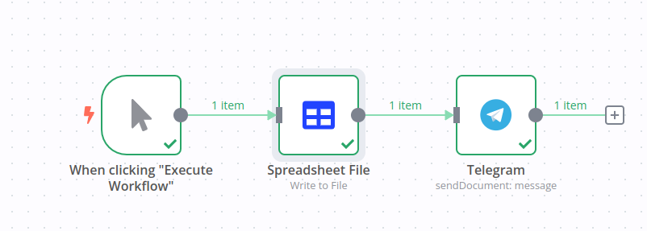
En resumen lo que voy a hacer es escribir en un fichero csv y se lo voy a mandar a mi bot de telegram.

Le damos a Write to File, le damos nombre en Binary Property, en options desplegamos File Name y le damos nombre
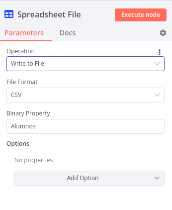

Ahora buscamos telegram y seleccionamos send Document, y marcamos todo de esta forma y así se enviará el fichero.
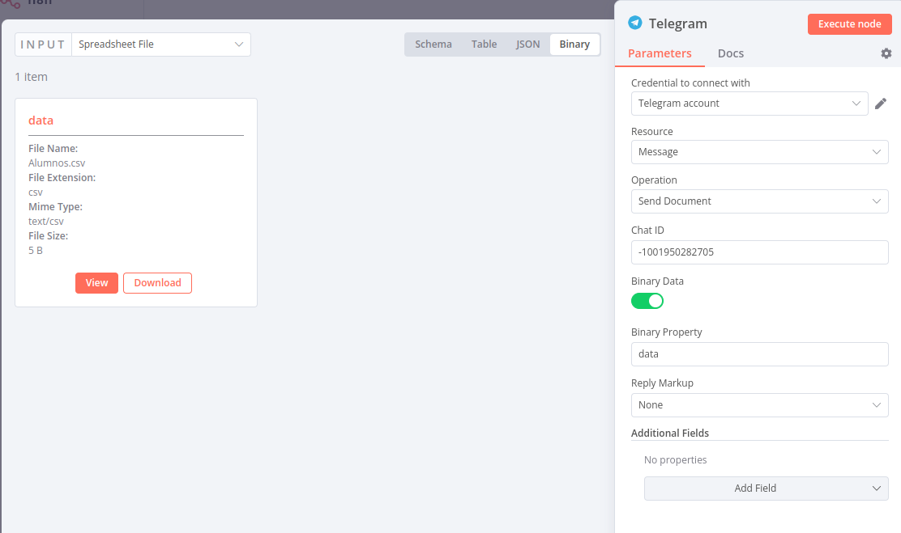

Y ya lo tendríamos, ahora le damos a Execute Workflow y vemos que nos ha enviado el fichero.


